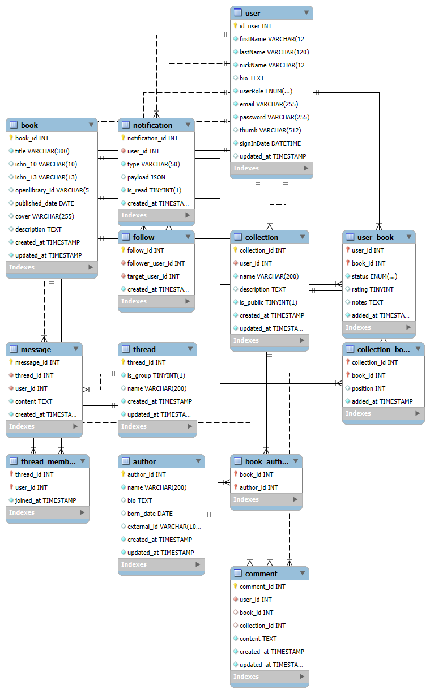

# my_books_db: Documentación del Modelo

Modelo relacional para la aplicación social de libros: usuarios, autores, obras, ediciones, biblioteca personal, colecciones y parte social (comentarios, follows, mensajería y notificaciones).

---

## 1. Visión General

- Catálogo normalizado en dos niveles: **obra** (`book`) y **edición concreta** (`edition`).
- Biblioteca y colecciones del usuario se relacionan con **ediciones**, no directamente con obras.
- Comentarios se asocian a **obras** (`book`) y/o **colecciones**, para agrupar reseñas por título.
- Funcionalidades sociales: comentarios, follows, hilos de mensajes y notificaciones.
- Uso de **InnoDB**, claves foráneas con estrategias `ON DELETE` explícitas y timestamps para trazabilidad.



---

## 2. Convenciones de Diseño

- Claves primarias: `tabla_id` (por ejemplo, `user_id`, `book_id`, `edition_id`).
- Juego de caracteres: `utf8mb4` y collation `utf8mb4_unicode_ci`.
- Timestamps estándar: `created_at` y `updated_at` cuando aplica.
- Borrado lógico de usuarios via `user.is_deleted`.

---

## 3. Entidades del Catálogo

### 3.1 `author`

- **PK**: `author_id` (INT UNSIGNED AUTO_INCREMENT).
- **Campos** principales:
  - `name` (NOT NULL)
  - `bio` (TEXT, NULL)
  - `born_date` (DATE, NULL)
  - `external_id` (VARCHAR, UNIQUE, NULL) – id externo (p.ej. Open Library).
  - `created_at`, `updated_at` (TIMESTAMP).
- **Uso**: catálogo de autores reutilizable en todas las obras.

### 3.2 `book` (Obra)

- **PK**: `book_id` (INT UNSIGNED AUTO_INCREMENT).
- **Campos** principales:
  - `title` (NOT NULL)
  - `openlibrary_work_id` (VARCHAR, UNIQUE, NULL) – id de _work_ en Open Library.
  - `description` (TEXT, NULL)
  - `created_at`, `updated_at`.
- **Uso**: representa la **obra abstracta** (título genérico), sin atarse a una edición/formato concreto.

### 3.3 `book_author` (N:M obra–autor)

- **PK compuesta**: (`book_id`, `author_id`).
- **FKs**:
  - `book_id` → `book(book_id)` (`ON DELETE CASCADE`).
  - `author_id` → `author(author_id)` (`ON DELETE CASCADE`).
- **Uso**: relación N:M entre obras y autores.

### 3.4 `edition` (Edición concreta)

- **PK**: `edition_id` (INT UNSIGNED AUTO_INCREMENT).
- **FK**:
  - `book_id` → `book(book_id)` (`ON DELETE CASCADE`).
- **Campos** principales:
  - `isbn_10`, `isbn_13` (UNIQUE, NULL).
  - `openlibrary_edition_id` (UNIQUE, NULL) – id de _edition_ en Open Library.
  - `language` (VARCHAR(3), NOT NULL) – ISO 639‑1/2.
  - `format` (ENUM: `hardcover`, `paperback`, `ebook`, `audiobook`, `other`).
  - `publish_date` (DATE, NULL), `pages` (INT UNSIGNED, NULL), `cover` (URL, NULL).
  - `created_at`, `updated_at`.
- **Uso**: cada fila representa una combinación concreta de obra + idioma + formato + editorial.

### 3.5 `genre` (Género)

- **PK**: `genre_id` (TINYINT UNSIGNED AUTO_INCREMENT).
- **Campos**:
  - `code` (VARCHAR(50), UNIQUE) – identificador interno estable, en inglés/snake_case (p.ej. `fantasy`, `sci_fi`).
  - `name` (VARCHAR(100)) – nombre legible (p.ej. "Fantasía", "Ciencia ficción").
  - `category` (ENUM: `fiction`, `nonfiction`, `format`) – tipo de género.
  - `genre_type` (ENUM: `system`, `custom`) – indica si es un género de sistema o creado por usuario (los seeds iniciales son `system`).
- **Uso**: lista controlada de géneros que la app ofrece al usuario (no se usan directamente los `subjects` de Open Library).

### 3.6 `book_genre` (N:M obra–género)

- **PK compuesta**: (`book_id`, `genre_id`).
- **FKs**:
  - `book_id` → `book(book_id)` (`ON DELETE CASCADE`).
  - `genre_id` → `genre(genre_id)` (`ON DELETE CASCADE`).
- **Uso**: asignar uno o varios géneros a cada obra (`book`).

---

## 4. Entidades de Usuario y Biblioteca

### 4.1 `user`

- **PK**: `user_id` (INT AUTO_INCREMENT).
- **Campos** principales:
  - `firstName`, `lastName`, `nickName` (UNIQUE), `bio` (NULL).
  - `userRole` (ENUM: `reader`, `writer`, `publisher`).
  - `email` (UNIQUE), `password` (hash), `thumb` (avatar opcional).
  - `signInDate`, `updated_at`.
  - `is_deleted` (TINYINT(1) NOT NULL DEFAULT 0) – soft delete.
- **Uso**: identidad de usuario, credenciales y metadatos.

#### Soft delete de usuario

- El borrado de cuenta se implementa como **borrado lógico**:
  - Se marca `is_deleted = 1`.
  - Opcionalmente se **anonimizan** campos personales (nombre, email, avatar, bio).
- Las consultas de usuarios activos deben filtrar `is_deleted = 0`.
- Si se hiciera un `DELETE` real sobre `user`, la BBDD está configurada para:
  - Borrar en cascada biblioteca, colecciones, follows, mensajes, notificaciones…
  - Mantener los comentarios, dejando `comment.user_id = NULL`.

### 4.2 `user_book` (Biblioteca personal)

- **PK compuesta**: (`user_id`, `edition_id`).
- **FKs**:
  - `user_id` → `user(user_id)` (`ON DELETE CASCADE`).
  - `edition_id` → `edition(edition_id)` (`ON DELETE CASCADE`).
- **Campos**:
  - `reading_status` (ENUM: `owned`, `reading`, `read`, `abandoned`, DEFAULT `owned`).
  - `rating` (TINYINT UNSIGNED, NULL) – p.ej. 0–10.
  - `notes` (TEXT, NULL).
  - `added_at` (TIMESTAMP, NOT NULL DEFAULT CURRENT_TIMESTAMP).
- **Uso**: qué ediciones posee/está leyendo/ha leído cada usuario.

### 4.3 `collection`

- **PK**: `collection_id` (INT UNSIGNED AUTO_INCREMENT).
- **FK**:
  - `user_id` → `user(user_id)` (`ON DELETE CASCADE`).
- **Campos**:
  - `name` (NOT NULL), `description` (TEXT, NULL).
  - `collection_type` (ENUM: `system`, `custom`, DEFAULT `custom`).
  - `is_public` (TINYINT(1) NOT NULL DEFAULT 0).
  - `created_at`, `updated_at`.
- **Uso**: listas del usuario (públicas o privadas), incluidas colecciones "de sistema".

### 4.4 `collection_book` (N:M colección–edición)

- **PK compuesta**: (`collection_id`, `edition_id`).
- **FKs**:
  - `collection_id` → `collection(collection_id)` (`ON DELETE CASCADE`).
  - `edition_id` → `edition(edition_id)` (`ON DELETE CASCADE`).
- **Campos**:
  - `position` (INT UNSIGNED, NULL) – orden manual.
  - `added_at` (TIMESTAMP NOT NULL DEFAULT CURRENT_TIMESTAMP).
- **Uso**: qué ediciones forman parte de cada colección y en qué orden.

---

## 5. Parte Social

### 5.1 `comment`

- **PK**: `comment_id` (INT UNSIGNED AUTO_INCREMENT).
- **FKs**:
  - `user_id` → `user(user_id)` (`ON DELETE SET NULL`).
  - `book_id` → `book(book_id)` (`ON DELETE CASCADE`, NULLable).
  - `collection_id` → `collection(collection_id)` (`ON DELETE CASCADE`, NULLable).
- **Campos**:
  - `content` (TEXT NOT NULL).
  - `created_at`, `updated_at`.
- **Uso**: comentarios sobre una obra (`book`) o sobre una colección (`collection`).
- **Detalle importante**: si el usuario se borra físicamente, el comentario **permanece**, pero `user_id` pasa a NULL.

### 5.2 `follow`

- **PK**: `follow_id` (INT UNSIGNED AUTO_INCREMENT).
- **Unicidad**: `UNIQUE(follower_user_id, target_user_id)`.
- **FKs**:
  - `follower_user_id` → `user(user_id)` (`ON DELETE CASCADE`).
  - `target_user_id` → `user(user_id)` (`ON DELETE CASCADE`).
- **Campos**:
  - `created_at`.
- **Uso**: relación "X sigue a Y" entre usuarios.

### 5.3 `thread` y `thread_member`

- **`thread`**
  - PK: `thread_id`.
  - Campos: `is_group` (TINYINT(1), DEFAULT 0), `name` (NULL), `created_at`, `updated_at`.
  - Uso: canales de mensajes 1:1 o grupales.

- **`thread_member`**
  - PK compuesta: (`thread_id`, `user_id`).
  - FKs: `thread_id` → `thread(thread_id)`, `user_id` → `user(user_id)` (ambas con `ON DELETE CASCADE`).
  - Campos: `joined_at`.
  - Uso: qué usuarios participan en qué hilos.

### 5.4 `message`

- **PK**: `message_id` (INT UNSIGNED AUTO_INCREMENT).
- **FKs**:
  - `thread_id` → `thread(thread_id)` (`ON DELETE CASCADE`).
  - `user_id` → `user(user_id)` (`ON DELETE CASCADE`).
- **Campos**:
  - `content` (TEXT NOT NULL).
  - `created_at`.
- **Uso**: mensajes enviados dentro de un hilo.

### 5.5 `notification`

- **PK**: `notification_id` (INT UNSIGNED AUTO_INCREMENT).
- **FK**:
  - `user_id` → `user(user_id)` (`ON DELETE CASCADE`).
- **Campos**:
  - `type` (VARCHAR(50) NOT NULL).
  - `payload` (JSON NULL) – detalles del evento.
  - `is_read` (TINYINT(1) NOT NULL DEFAULT 0).
  - `created_at`.
- **Uso**: notificaciones dirigidas a usuarios (nuevo comentario, nuevo seguidor, nuevo mensaje, etc.).

---

## 6. Relaciones Clave (Resumen)

- `author` ↔ `book`: N:M vía `book_author`.
- `book` ↔ `edition`: 1:N (una obra, varias ediciones).
- `book` ↔ `genre`: N:M vía `book_genre`.
- `user` ↔ `edition`: N:M vía `user_book`.
- `user` ↔ `collection` ↔ `edition`: `collection` (1:N desde `user`), `collection_book` (N:M con `edition`).
- Social:
  - `user` ↔ `comment` (1:N, con `SET NULL` al borrar usuario).
  - `user` ↔ `follow` (auto-relación N:M con tabla `follow`).
  - `thread` ↔ `thread_member` (N:M con `user`).
  - `thread` ↔ `message` (1:N).
  - `user` ↔ `notification` (1:N).

---

## 7. Consultas Útiles (Ejemplos)

### 7.1 Catálogo y ediciones

**Obras de un autor:**

```sql
SELECT b.*
FROM book_author ba
JOIN book b ON b.book_id = ba.book_id
WHERE ba.author_id = ?;
```

**Ediciones de una obra concreta:**

```sql
SELECT e.*
FROM edition e
WHERE e.book_id = ?
ORDER BY e.publish_date DESC;
```

**Buscar obras por título (búsqueda simple):**

```sql
SELECT b.*
FROM book b
WHERE b.title LIKE CONCAT('%', ?, '%')
ORDER BY b.title;
```

### 7.2 Biblioteca del usuario

**Ediciones que un usuario está leyendo:**

```sql
SELECT e.*, b.title
FROM user_book ub
JOIN edition e ON e.edition_id = ub.edition_id
JOIN book b ON b.book_id = e.book_id
JOIN user u ON u.user_id = ub.user_id AND u.is_deleted = 0
WHERE ub.user_id = ?
  AND ub.reading_status = 'reading';
```

**Todas las ediciones de la biblioteca de un usuario (con estado):**

```sql
SELECT e.edition_id,
       b.title,
       ub.reading_status,
       ub.rating,
       ub.notes,
       ub.added_at
FROM user_book ub
JOIN edition e ON e.edition_id = ub.edition_id
JOIN book b ON b.book_id = e.book_id
WHERE ub.user_id = ?
ORDER BY ub.added_at DESC;
```

### 7.3 Colecciones

**Colecciones públicas de un usuario:**

```sql
SELECT c.*
FROM collection c
JOIN user u ON u.user_id = c.user_id AND u.is_deleted = 0
WHERE c.user_id = ?
  AND c.is_public = 1;
```

**Ediciones dentro de una colección (en orden):**

```sql
SELECT e.*, b.title, cb.position
FROM collection_book cb
JOIN edition e ON e.edition_id = cb.edition_id
JOIN book b ON b.book_id = e.book_id
WHERE cb.collection_id = ?
ORDER BY cb.position, cb.added_at;
```

### 7.4 Comentarios

**Comentarios de una obra (incluyendo usuario si existe):**

```sql
SELECT c.comment_id,
       c.content,
       c.created_at,
       u.nickName,
       u.is_deleted
FROM comment c
LEFT JOIN user u ON u.user_id = c.user_id
WHERE c.book_id = ?
ORDER BY c.created_at DESC;
```

En la capa de aplicación puedes decidir qué mostrar cuando `u.user_id` es NULL o `is_deleted = 1` (p.ej. "Usuario eliminado").

**Comentarios de una colección:**

```sql
SELECT c.*, u.nickName
FROM comment c
LEFT JOIN user u ON u.user_id = c.user_id
WHERE c.collection_id = ?
ORDER BY c.created_at DESC;
```

### 7.5 Seguimiento y social

**Usuarios que sigue un usuario dado:**

```sql
SELECT u_target.*
FROM follow f
JOIN user u_target ON u_target.user_id = f.target_user_id AND u_target.is_deleted = 0
WHERE f.follower_user_id = ?;
```

**Seguidores de un usuario dado:**

```sql
SELECT u_follower.*
FROM follow f
JOIN user u_follower ON u_follower.user_id = f.follower_user_id AND u_follower.is_deleted = 0
WHERE f.target_user_id = ?;
```

### 7.6 Mensajería y notificaciones

**Mensajes de un hilo (paginables):**

```sql
SELECT m.message_id,
       m.content,
       m.created_at,
       u.nickName
FROM message m
JOIN user u ON u.user_id = m.user_id AND u.is_deleted = 0
WHERE m.thread_id = ?
ORDER BY m.created_at DESC
LIMIT ? OFFSET ?;
```

**Notificaciones no leídas de un usuario:**

```sql
SELECT n.*
FROM notification n
JOIN user u ON u.user_id = n.user_id AND u.is_deleted = 0
WHERE n.user_id = ?
  AND n.is_read = 0
ORDER BY n.created_at DESC;
```

---

## 8. Soft Delete de Usuario: Instrucciones Prácticas

### 8.1 Marcar un usuario como eliminado

```sql
UPDATE user
SET
  firstName  = NULL,
  lastName   = NULL,
  nickName   = CONCAT('deleted_', user_id),
  bio        = NULL,
  email      = CONCAT('deleted+', user_id, '@example.invalid'),
  password   = '<hash_generico_o_random>',
  thumb      = NULL,
  is_deleted = 1,
  updated_at = CURRENT_TIMESTAMP
WHERE user_id = ?;
```

### 8.2 Consultar solo usuarios activos

```sql
SELECT *
FROM user
WHERE user_id = ?
  AND is_deleted = 0;
```

En joins:

```sql
SELECT ub.*, e.*, b.title
FROM user_book ub
JOIN user u    ON u.user_id = ub.user_id AND u.is_deleted = 0
JOIN edition e ON e.edition_id = ub.edition_id
JOIN book b    ON b.book_id = e.book_id
WHERE ub.user_id = ?;
```

### 8.3 Nota sobre borrado físico

- No se recomienda ejecutar `DELETE FROM user` en flujo normal.
- Si se hace, gracias a `ON DELETE SET NULL` en `comment.user_id`, los comentarios seguirán existiendo pero ya no estarán asociados a un usuario concreto.

---

## 9. Flujo de Registro de Usuario

Este flujo describe, a nivel de BBDD, qué ocurre cuando se registra un usuario nuevo en la aplicación.

### 9.1 Pasos lógicos

1. Insertar el usuario en la tabla `user` (con la contraseña ya hasheada por la API).
2. Recuperar el `user_id` recién creado.
3. Crear automáticamente las colecciones de sistema del usuario, por ejemplo:
   - `Favorites` (colección de libros favoritos).
   - `Wishlist` (lista de deseos).

Todo ello debería ejecutarse en una **transacción** para garantizar consistencia.

### 9.2 Ejemplo SQL (transacción)

```sql
START TRANSACTION;

INSERT INTO user (firstName, lastName, nickName, userRole, email, password)
VALUES (:firstName, :lastName, :nickName, 'reader', :email, :password_hash);

SET @new_user_id = LAST_INSERT_ID();

INSERT INTO collection (user_id, name, collection_type, is_public)
VALUES
  (@new_user_id, 'Favorites', 'system', 0),
  (@new_user_id, 'Wishlist',  'system', 0);

COMMIT;
```

- `:password_hash` debe ser calculado en el backend (por ejemplo, con bcrypt) antes del `INSERT`.
- Puedes añadir más colecciones de sistema según las necesidades de la app.

En la **documentación de la API**, este comportamiento se describirá como parte del endpoint de registro (p.ej. `POST /register`).

---

## 10. Flujo de Añadir un Libro a la Cuenta de Usuario

Este flujo cubre desde que el usuario elige una obra/edición en Open Library hasta que la edición queda asociada a su biblioteca (`user_book`).

### 10.1 Pasos lógicos

1. **Buscar obra/ediciones en Open Library** desde el frontend (no es parte de la BBDD).
2. El usuario selecciona una **edición concreta**.
3. En el backend, con los datos de Open Library:
   - Localizar o crear la **obra** en `book` usando `openlibrary_work_id`.
   - Localizar o crear la **edición** en `edition` usando `openlibrary_edition_id` o ISBN.
4. Insertar (o asegurar la existencia de) la relación en `user_book` para esa `edition_id` y `user_id`.

Idealmente, estos pasos 3–4 se encapsulan también en una transacción.

### 10.2 Ejemplo SQL: upsert de obra y edición

Supongamos que recibimos del backend algo así:

- `:work_id` → `openlibrary_work_id` de la obra.
- `:edition_id_ol` → `openlibrary_edition_id` de la edición elegida.
- `:title`, `:description` → metadatos de la obra.
- `:isbn10`, `:isbn13`, `:language`, `:format`, `:publish_date`, `:pages`, `:cover` → metadatos de la edición.

```sql
START TRANSACTION;

-- 1) Asegurar la obra (book)
INSERT INTO book (title, openlibrary_work_id, description)
VALUES (:title, :work_id, :description)
ON DUPLICATE KEY UPDATE
  title       = VALUES(title),
  description = VALUES(description);

-- Recuperar el book_id asegurado
SELECT book_id INTO @book_id
FROM book
WHERE openlibrary_work_id = :work_id;

-- 2) Asegurar la edición (edition)
INSERT INTO edition (
  book_id,
  isbn_10,
  isbn_13,
  openlibrary_edition_id,
  language,
  format,
  publish_date,
  pages,
  cover
)
VALUES (
  @book_id,
  :isbn10,
  :isbn13,
  :edition_id_ol,
  :language,
  :format,
  :publish_date,
  :pages,
  :cover
)
ON DUPLICATE KEY UPDATE
  book_id  = VALUES(book_id),
  language = VALUES(language),
  format   = VALUES(format),
  pages    = VALUES(pages),
  cover    = VALUES(cover);

-- Recuperar el edition_id asegurado
SELECT edition_id INTO @edition_id
FROM edition
WHERE openlibrary_edition_id = :edition_id_ol;

COMMIT;
```

### 10.3 Asociar la edición a la biblioteca del usuario

Una vez que tenemos `@edition_id` y el `:user_id` (usuario autenticado):

```sql
INSERT INTO user_book (user_id, edition_id, reading_status)
VALUES (:user_id, @edition_id, 'owned')
ON DUPLICATE KEY UPDATE
  reading_status = VALUES(reading_status),
  added_at       = CURRENT_TIMESTAMP;
```

- La **PK compuesta** (`user_id`, `edition_id`) evita duplicados, y con `ON DUPLICATE KEY UPDATE` puedes actualizar el estado de lectura si el libro ya estaba en la biblioteca.
- `reading_status` inicial podría ser `owned`, `reading` o el que definas por negocio.

De nuevo, este paso suele ejecutarse dentro de una transacción junto con el upsert de `book` y `edition`.

En la documentación del API, este flujo correspondería a un endpoint del estilo `POST /user/books` o similar.

---

## 11. Seeds Mínimos (Datos de Prueba)

Ejemplo rápido adaptado al modelo **obra + edición**:

```sql
-- Usuarios
INSERT INTO user (firstName, lastName, nickName, userRole, email, password)
VALUES ('Ana','García','ana_g','reader','ana@example.com','hash1'),
       ('Luis','Pérez','lperez','reader','luis@example.com','hash2');

-- Autores
INSERT INTO author (name) VALUES ('Isaac Asimov'), ('Ursula K. Le Guin');

-- Obras
INSERT INTO book (title, openlibrary_work_id)
VALUES ('Foundation', 'OL123W'),
       ('A Wizard of Earthsea', 'OL456W');

-- Relación obra–autor
INSERT INTO book_author (book_id, author_id)
SELECT b.book_id, a.author_id FROM book b, author a
WHERE (b.title = 'Foundation' AND a.name = 'Isaac Asimov')
   OR (b.title = 'A Wizard of Earthsea' AND a.name = 'Ursula K. Le Guin');

-- Ediciones
INSERT INTO edition (book_id, isbn_13, language, format)
SELECT b.book_id, '9780553293357', 'eng', 'paperback'
FROM book b WHERE b.title = 'Foundation';

INSERT INTO edition (book_id, isbn_13, language, format)
SELECT b.book_id, '9780547773742', 'eng', 'paperback'
FROM book b WHERE b.title = 'A Wizard of Earthsea';

-- Biblioteca del usuario (Ana)
INSERT INTO user_book (user_id, edition_id, reading_status)
SELECT u.user_id, e.edition_id, 'reading'
FROM user u, edition e, book b
WHERE u.nickName = 'ana_g'
  AND e.book_id = b.book_id
  AND b.title = 'Foundation';

-- Colección y sus ediciones
INSERT INTO collection (user_id, name, is_public)
SELECT u.user_id, 'Sci-Fi Favorites', 1 FROM user u WHERE u.nickName = 'ana_g';

INSERT INTO collection_book (collection_id, edition_id, position)
SELECT c.collection_id, e.edition_id, 1
FROM collection c, edition e, book b
WHERE c.name = 'Sci-Fi Favorites'
  AND e.book_id = b.book_id
  AND b.title = 'Foundation';

-- Comentario sobre la obra
INSERT INTO comment (user_id, book_id, content)
SELECT u.user_id, b.book_id, 'Clásico imprescindible'
FROM user u, book b
WHERE u.nickName = 'ana_g'
  AND b.title = 'Foundation';
```

> Sugerencia: añade índices adicionales (por ejemplo, por `created_at`) en las tablas que alimenten feeds o listados ordenados por fecha.

---

## 12. Roadmap funcional (Front + Back)

Esta sección conecta el modelo `my_books_db` con las features previstas en el front (React) y la API (Node/Express). No es una lista cerrada, sino una guía de evolución.

### 12.1 Buscador y detalle de obras

- **Front**
  - Buscador de libros por título/autor usando Open Library (ya en marcha).
  - Vista de detalle de obra: título, autores, géneros, sinopsis y ediciones disponibles.
  - Mostrar reseñas (comentarios) y valoración media de la obra.
- **Back/API**
  - Opcional: endpoints de apoyo para cachear resultados de Open Library o enriquecerlos con datos propios (`book`, `edition`, `book_genre`).
  - Exponer `GET /books/:book_id` (obra) y `GET /books/:book_id/editions` (ediciones).

### 12.2 Biblioteca personal

- **Front**
  - Vista "Mi biblioteca" con paginación, filtros por estado de lectura, ordenaciones.
  - Ficha rápida de cada libro/edición (portada, título, autor, estado, rating).
  - Formulario para cambiar `reading_status`, valorar (`rating`) y añadir notas.
  - Flujo para añadir libro desde una búsqueda en Open Library o alta manual.
- **Back/API**
  - Endpoints `/user/books` descritos en el roadmap de API (alta/baja/actualización de ediciones en `user_book`).
  - Gestión de estados de lectura y ratings como campos nativos de `user_book`.

### 12.3 Colecciones (listas)

- **Front**
  - Gestión de colecciones: crear, renombrar, borrar, cambiar visibilidad (pública/privada).
  - Añadir/quitar libros de una colección desde la biblioteca o desde el detalle de obra.
  - Reordenar libros dentro de una colección (drag & drop sobre `position`).
  - Vista pública de una colección (URL compartible).
- **Back/API**
  - Endpoints sobre `collection` y `collection_book` para CRUD y ordenación.
  - Listados de colecciones públicas de un usuario o de la comunidad.

### 12.4 Social: comentarios, follows y feed

- **Front**
  - Sistema de comentarios en la página de una obra y en la de una colección.
  - Perfil público de usuario con sus colecciones públicas, últimas reseñas, seguidores/seguidos.
  - Feed sencillo de actividad: nuevos comentarios de seguidos, nuevas colecciones públicas, etc.
- **Back/API**
  - Endpoints de comentarios sobre `comment` (libros y colecciones) y de seguimiento `follow`.
  - Consultas típicas: comentarios recientes de una obra, comentarios de usuarios seguidos, etc.
  - Preparar vistas SQL/consultas para alimentar un feed ordenado por `created_at`.

### 12.5 Géneros y descubrimiento

- **Front**
  - Selector de géneros preferidos en el perfil del usuario.
  - Filtros por género en el buscador y en la biblioteca.
  - Páginas tipo "Explorar" por género ("Fantasía", "No ficción", etc.).
- **Back/API**
  - Uso de `genre` y `book_genre` para filtrar obras en consultas de catálogo.
  - Endpoints para leer géneros (`GET /genres`) y, opcionalmente, guardar preferencias de usuario.

### 12.6 Mensajería y notificaciones

- **Front**
  - Bandeja de entrada con lista de hilos (`thread`) y conteo de mensajes no leídos.
  - Vista de conversación tipo chat (scroll, paginación por fecha).
  - Centro de notificaciones: nuevos seguidores, comentarios en tus obras/colecciones, etc.
- **Back/API**
  - Endpoints sobre `thread`, `thread_member` y `message` para mensajería privada/grupal.
  - Endpoints sobre `notification` para listar y marcar como leídas.
  - Posible lógica de negocio para disparar notificaciones a partir de eventos (nuevo comentario, nuevo follow, etc.).

Este roadmap funcional se apoya en el modelo de datos ya definido, de forma que cada nueva pantalla del front pueda mapearse con claridad a una o varias consultas y endpoints de la API.
